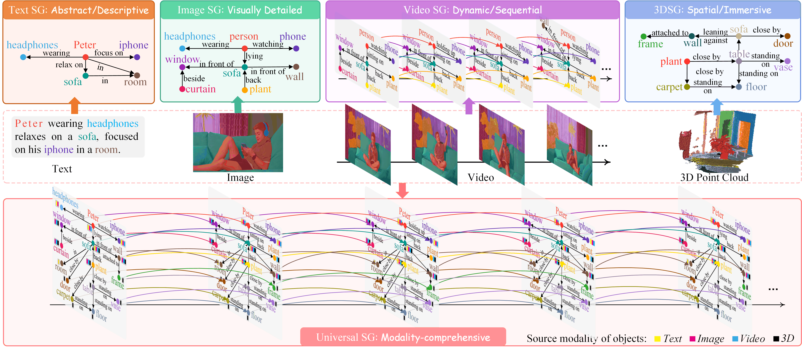
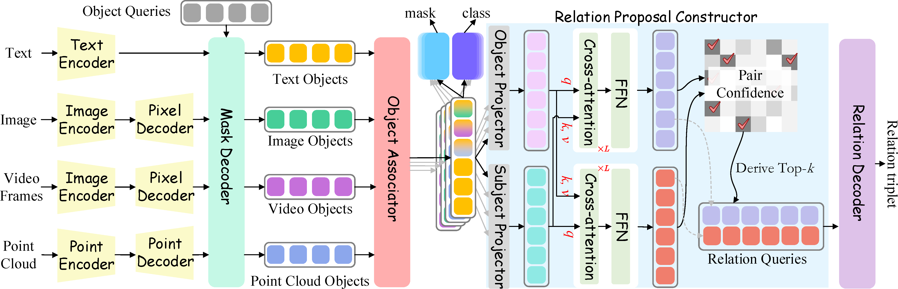

## <div align="center"> Universal Scene Graph Generation<div>


##### <div align="center"> <a href="https://chocowu.github.io/">Shengqiong Wu</a>, <a href="http://haofei.vip/">Hao Fei</a>*, and <a href="https://www.chuatatseng.com/">Tat-Seng Chua</a>. <div>
##### <div align="center"> (*Correspondence ) <div>

<div align="center">

[Paper (arXiv:2503.15005)](https://arxiv.org/abs/2503.15005) · [Project page](https://sqwu.top/USG/)

</div>


## Abstract

Scene graph (SG) representations can neatly and efficiently describe scene semantics, which has driven sustained intensive research in SG generation.
In the real world, multiple modalities often coexist, with different types, such as images, text, video, and 3D data, expressing distinct characteristics.
Unfortunately, current SG research is largely confined to single-modality scene modeling, preventing the full utilization of the complementary strengths of different modality SG representations in depicting holistic scene semantics.
To this end, we introduce Universal SG (USG), a novel representation capable of fully characterizing comprehensive semantic scenes from any given combination of modality inputs, encompassing modality-invariant and modality-specific scenes.
Further, we tailor a niche-targeting USG parser, USG-Par, which effectively addresses two key bottlenecks of cross-modal object alignment and out-of-domain challenges.
We design the USG-Par with modular architecture for end-to-end USG generation, in which we devise an object associator to relieve the modality gap for cross-modal object alignment.
Further, we propose a text-centric scene contrasting learning mechanism to mitigate domain imbalances by aligning multimodal objects and relations with textual SGs. 
Through extensive experiments, we demonstrate that USG offers a stronger capability for expressing scene semantics than standalone SGs, and also that our USG-Par achieves higher efficacy and performance.

<!--  -->


 


## Method
Our model consists of five main modules.
***First***, we extract the modality-specific features with a modality-specific backbone. 
***Second***, we employ a shared mask decoder to extract object queries for various modalities. 
These object queries are then fed into the modality-specific object detection head to obtain the category label and tracked positions of the corresponding objects. 
***Third***, the object queries are input into the object associator, which determines the association relationships between objects across modalities. 
***Fourth***, a relation proposal constructor is utilized to retrieve the most confidential subject-object pairs. 
***Finally***, a relation decoder is employed to decode the final predicate prediction between the subjects and objects.

  

The five modules map to the code as follows:

| Paper module | Code |
| --- | --- |
| Modality-specific encoders | `usg_par/encoders/` (`text_encoder.py`, `image_encoder.py`, `point_encoder.py`) |
| Shared mask decoder (+ `F_temp`) | `usg_par/mask_decoder.py` |
| Object associator | `usg_par/associator.py` |
| Detection head | `usg_par/detection_head.py` |
| Relation proposal constructor | `usg_par/rpc.py` |
| Relation decoder | `usg_par/relation_decoder.py` |
| Losses `L_obj/L_ass/L_rel/L_cons` | `usg_par/losses.py`, `usg_par/training/` |
| Assembly | `usg_par/model.py` (`USGParCore` + `USGPar`) |


## Data 

To evaluate the efficacy of USG-Par, which supports both single-modality and multi-modality scene parsing, we utilize existing single-modality datasets and a manually constructed multimodal dataset.

* Single-modal Dataset

  - Image:
    1) [Visual Genome (VG)](data/VG/README.md)
    2) [Panoptic Scene Graph (PSG)](data/PSG/README.md)
  - Video:
    1) [Action Genome (AG)](data/AG/README.md)
    2) [Panoptic Video Scene Graph (PVSG)](data/PVSG/README.md)
  - Text:
    1) [FACUTAL](data/FACTUAL/README.md)
  - 3DSG
    1) [3D Scene Graph (3DSG)](data/3DSG/README.md)
  
  please refer to the corresponding instructions for dataset preparation.

* Multi-modal Dataset

  Cross-modal **pair recipes** and their construction (data sources, association
  targets, code locations) are documented in
  [`data/multimodal/README.md`](data/multimodal/README.md).


## Code

### Environment Preparation

```bash
conda activate usg
pip install torch torchvision numpy einops scipy pyyaml pytest tqdm \
            open_clip_torch timm av plyfile matplotlib SceneGraphParser
python -m spacy download en_core_web_sm       
```


### Download Checkpoint

Pretrained weights are gitignored under `checkpoints/`:

- **OpenCLIP** `convnext_large_d_320 / laion2b_s29b_b131k_ft_soup` → `checkpoints/openclip/`
  (auto-downloaded by `usg_par/encoders/builders.py`, or place a local snapshot there).
- **Point-BERT** `PointTransformer_ModelNet8192points.pth` → `checkpoints/point_bert/`.

### Repository structure

```
usg_par/
  encoders/        text / image / point encoders + pixel/point decoders
  mask_decoder.py  shared Mask2Former decoder + temporal encoder
  associator.py    object associator
  detection_head.py modality-specific detection head
  rpc.py           relation proposal constructor
  relation_decoder.py relation decoder
  losses.py        L_obj / L_ass / L_rel / L_cons + Hungarian matcher
  model.py         USGParCore (encoder-agnostic) + USGPar (with encoders)
  datasets/        PSG, PVSG, FACTUAL, 3DDSG + I-V/I-D/S-I/S-D pair datasets
  training/        target construction + single/multi-modal loss assembly
  eval/            Recall@K/mR@K, Set Match, Association Accuracy@K, triplet builders
train.py, eval.py  single-dataset training / evaluation entry points
train_joint.py, eval_joint.py  two-stage joint training / unified-model evaluation
configs/           per-dataset YAML (psg, pvsg, 3ddsg, factual) + joint.yaml
tools/             recipe builders, smoke runs, encoder/3D visualization checks
```

### Run the code

#### Training

Single-modality (config-driven; `dataset.name` + `train.modality` select the line):

```bash
conda activate usg
CUDA_VISIBLE_DEVICES=0 python train.py --config configs/psg.yaml      # image
CUDA_VISIBLE_DEVICES=0 python train.py --config configs/pvsg.yaml     # video (+F_temp)
CUDA_VISIBLE_DEVICES=0 python train.py --config configs/3ddsg.yaml    # point cloud
CUDA_VISIBLE_DEVICES=0 python train.py --config configs/factual.yaml  # text
```

Cross-modal training uses dedicated steps in `train.py` (`iv_train_step`,
`id_train_step`, `si_train_step`, `sd_train_step`) which build the query-level
association target and add `L_ass` (+ `L_cons` for text pairs). 
Runnable end-to-end
examples are under `tools/smoke_*`:

```bash
CUDA_VISIBLE_DEVICES=0 python tools/smoke_si_overfit.py   # S-I Assoc Acc 0→100%
CUDA_VISIBLE_DEVICES=0 python tools/smoke_id_overfit.py   # I-D Assoc Acc 12.5→50%
```

**Joint (two-stage) training** (`train_joint.py`, `configs/joint.yaml`) — domain-balanced
joint training over a **union vocabulary** (object/predicate classes merged by name
across datasets). Single-dataset training above is unchanged.

- **Stage 1** interleaves the 4 single-modality datasets (PSG / PVSG / FACTUAL / 3DDSG)
  by temperature sampling (weight ∝ size**(1/T)); labels are remapped to the union vocab.
- **Stage 2** loads the stage-1 checkpoint and trains the 4 cross-modal pairs
  (I-V / I-D / S-I / S-D) with `L_ass` (+ `L_cons`).

```bash
conda activate usg
# both stages (stage 1 -> stage 2); or --stage 1 / --stage 2 individually
CUDA_VISIBLE_DEVICES=0 python train_joint.py --config configs/joint.yaml --stage both
CUDA_VISIBLE_DEVICES=0  python train_joint.py --config configs/joint.yaml --stage 2 \
    --stage1-ckpt checkpoints/joint/stage1.pt
```


####  Inference

Per-line (single-dataset) evaluation:

```bash
python eval.py --config configs/psg.yaml --ckpt <path> --task sgdet   # R@K / mR@K
python eval.py --config configs/factual.yaml --ckpt <path>            # Set Match
```

Joint-model evaluation (one command over every split — R@K/mR@K for image/video/point,
Set Match for text, Association Accuracy@5 for the four pairs; datasets are remapped to
the union vocab):

```bash
CUDA_VISIBLE_DEVICES=0 python eval_joint.py --config configs/joint.yaml \
    --ckpt checkpoints/joint/stage2.pt
```

`eval.limit` in the config caps samples per split (set to `null` for full evaluation).


## Citation

If you use USG in your project, please kindly cite:
```
@inproceedings{wu2025usg,
    title={Universal Scene Graph Generation},
    author={Wu, Shengqiong and Fei, Hao and Chua, Tat-Seng},
    booktitle={CVPR},
    year={2025}
}
```


# Website License
<a rel="license" href="http://creativecommons.org/licenses/by-sa/4.0/"></a><br />This work is licensed under a <a rel="license" href="http://creativecommons.org/licenses/by-sa/4.0/">Creative Commons Attribution-ShareAlike 4.0 International License</a>.