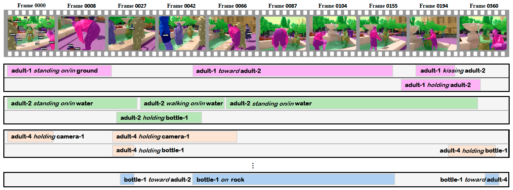

# Panoptic Video Scene Graph (PVSG)

## What is PVSG Task?
<strong>The Panoptic Video Scene Graph Generation (PVSG) Task</strong> aims to interpret a complex scene video with a dynamic scene graph representation, with each node in the scene graph grounded by its pixel-accurate segmentation mask tube in the video.

|  |
|:--:|
| <b>Given a video, PVSG models need to generate a dynamic (temporal) scene graph that is grounded by panoptic mask tubes.</b>|


## The PVSG Dataset
We carefully collect 400 videos, each featuring dynamic scenes and rich in logical reasoning content. On average, these videos are 76.5 seconds long (5 FPS). The collection comprises 289 videos from VidOR, 55 videos from EpicKitchen, and 56 videos from Ego4D.

Please access the dataset via this [link](https://entuedu-my.sharepoint.com/:f:/g/personal/jingkang001_e_ntu_edu_sg/EpHpnXP-ta9Nu1wD6FwkDWAB0LxY8oE9VNqsgv6ln-i8QQ?e=fURefF), and put the downloaded zip files to the place below.
```
├── assets
├── checkpoints
├── configs
├── data
├── data_zip
│   ├── Ego4D
│   │   ├── ego4d_masks.zip
│   │   └── ego4d_videos.zip
│   ├── EpicKitchen
│   │   ├── epic_kitchen_masks.zip
│   │   └── epic_kitchen_videos.zip
│   ├── VidOR
│   │   ├── vidor_masks.zip
│   │   └── vidor_videos.zip
│   └── pvsg.json
├── datasets
├── models
├── scripts
├── tools
├── utils
├── .gitignore
├── environment.yml
└── README.md
```
Please run `unzip_and_extract.py` to unzip the files and extract frames from the videos. If you use `zip`, make sure to use `unzip -j xxx.zip` to remove junk paths. You should have your `data` directory looks like this:
```
data
├── ego4d
│   ├── frames
│   ├── masks
│   └── videos
├── epic_kitchen
│   ├── frames
│   ├── masks
│   └── videos
├── vidor
│   ├── frames
│   ├── masks
│   └── videos
└── pvsg.json
```

We suggest our users to play with `./Understanding PVSG Dataset.ipynb` to quickly get familiar with PSG dataset.