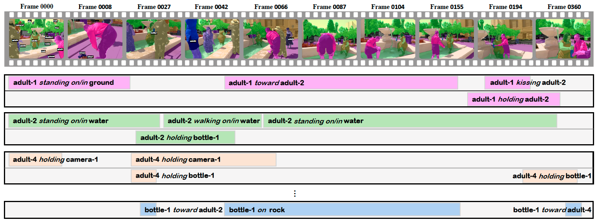

# Panoptic Video Scene Graph (PVSG)

The **Panoptic Video Scene Graph Generation (PVSG) Task** aims to interpret a complex scene video with a dynamic scene graph representation, with each node in the scene graph grounded by its pixel-accurate segmentation mask tube in the video.

|  |
|:--:|
| Given a video, PVSG models need to generate a dynamic temporal scene graph grounded by panoptic mask tubes. |

## Download

Download the offical data from dataset [OpenPVSG](https://github.com/LilyDaytoy/OpenPVSG) release, and put the downloaded zip files under:

```text
data/PVSG/
```

The downloaded files should be organized as:

```text
PVSG/
|-- Ego4D/
|   |-- ego4d_masks.zip
|   `-- ego4d_videos.zip
|-- EpicKitchen/
|   |-- epic_kitchen_masks.zip
|   `-- epic_kitchen_videos.zip
|-- VidOR/
|   |-- vidor_masks.zip
|   `-- vidor_videos.zip
`-- pvsg.json
```

## Expected File Structure

Run `unzip_and_extract.py` to unzip the files and extract frames from the videos. If you use `zip`, make sure to use `unzip -j xxx.zip` to remove junk paths.

After extraction, the `data/PVSG/` directory should look like this:

```text
PVSG/
|-- ego4d/
|   |-- frames/
|   |-- masks/
|   `-- videos/
|-- epic_kitchen/
|   |-- frames/
|   |-- masks/
|   `-- videos/
|-- vidor/
|   |-- frames/
|   |-- masks/
|   `-- videos/
`-- pvsg.json
```

## Notebook

We suggest users play with `./Understanding PVSG Dataset.ipynb` to quickly get familiar with the PVSG dataset.
